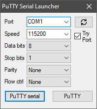

# [PuTTY](https://www.putty.org/) serial connection launcher (Windows-only)

This tool makes it easy to select serial communication parameters. After start, PuTTY Serial Launcher receives a list of available ports and loads the saved serial settings from the PuTTY Default Session. When the `Try Port` checkbox is active, the list includes only ports available for opening that are not currently used by other applications.

## How to use

Place `putty_serial_launcher.exe` from [releases](https://github.com/aromprg/putty_serial_launcher/releases) in the directory containing [putty.exe](https://www.putty.org/).

## Build from source
1. Install [Mingw-w64](https://www.mingw-w64.org/)
2. `git clone https://github.com/aromprg/putty_serial_launcher`
3. Open a command prompt, change to the directory containing the makefile, and type `mingw32-make`. To compile an Unicode build run `mingw32-make CHARSET=UNICODE`
